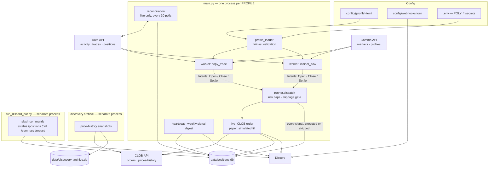

# Polymarket Copy-Trading Bot

An automated trading bot for Polymarket. The goal is to make money on
prediction markets — and to know, from the record it keeps, whether it
actually is.

Strategies are pluggable and each one runs as an independent worker with
its own risk limits, bankroll, and paper-or-live mode, so a new idea can be
validated on paper alongside real trading in the same process. Every
position, fill, and signal lands in SQLite for later review.

## Architecture



## Repo map

```
main.py        entry point — one worker thread per enabled algorithm
bot/           shared infra — domain/, storage/, execution/, polymarket/, discord/, logs/
algorithms/    strategies — copy_trade/, insider_flow/
config/        profile TOMLs (behavior) + webhooks.toml (Discord routing)
discovery/     price-history archiver
scripts/       deploy, wallet-history importers, DB reset, account summary
tests/         pytest suite
research/      strategy plans and paper-phase notes
data/          SQLite files — gitignored
```

Adding a strategy means subclassing `Algorithm`, registering it in
`algorithms/__init__.py:REGISTRY`, and naming it in a profile TOML.

## Setup

```bash
python3 -m venv .venv
source .venv/bin/activate
pip install -r requirements.txt        # runtime deps + pytest
cp .env.example .env                   # secrets only — see below
```

Configuration lives in three files, split by kind:

| File | Holds |
|---|---|
| `config/<profile>.toml` | *Behavior* — which algorithms run, mode, targets, tiers, risk caps |
| `config/webhooks.toml` | *Discord routing* — which channel each profile's summaries go to |
| `.env` | *Secrets only* — the five `POLY_*` creds, Discord bot token |

There is **no global paper/live switch.** Mode is declared per `[[algorithm]]`
block, so one process can run live and paper algorithms side by side. A
profile must set top-level `allow_live = true` before any `mode = "live"`
block is accepted, and only `prod.toml` sets it.

## Testing

```bash
pytest
pytest tests/test_copy_trade.py
```

## Deployment

Runs on a VPS as plain Python processes under tmux.

```bash
bash scripts/ssh_vm.sh                       # opc@148.116.94.154, ~/Polymarket
cd ~/Polymarket && bash scripts/setup_vm.sh  # full redeploy
```

`setup_vm.sh` is the entire deploy: git pull, venv + deps, `data/` layout,
env hygiene (verifies the five `POLY_*` creds, strips stale non-secret
keys), profile validation, then a clean restart of the tmux sessions with
crash-visible panes — `remain-on-exit` is set, so attaching after a death
shows the traceback instead of an empty screen. Idempotent. It exits
non-zero if a session dies at boot and prints that session's last output.

| Session | Command |
|---|---|
| `paper` | `PROFILE=experimental python main.py` |
| `prod` | `PROFILE=prod python main.py` — started only if `config/prod.toml` declares `[[algorithm]]` blocks |
| `archive` | `python -m discovery.archive --loop --every 3600` |
| `discord` | `python scripts/run_discord_bot.py` — one bot, all profiles |

`tmux attach -t <name>` to view, `Ctrl-b d` to detach without killing.

`data/positions.db` and `.env` live only on the host — both are gitignored
and must survive redeploys.

After a deploy, check: one startup line per algorithm in
`tmux attach -t paper` and in Discord, and a first-pass summary in `archive`
(`tracked_added` / `points_added`).

## Monitoring

Discord is the interface. Trade alerts post to a per-market thread as they
happen; the profile's summary channel gets a liveness heartbeat every 6
hours, a signal digest on Sundays, and a portfolio summary whenever you ask
for one with `/summary`.

Slash commands — one bot, serving every profile:

| Command | What it reports |
|---|---|
| `/status` | Every algorithm, grouped by profile: paper/live mode, open position count, exposure, and today's P&L |
| `/positions [algo]` | Each open position — outcome, shares, average price, cost, market — optionally filtered to algorithms whose name contains `algo` |
| `/pnl` | Today's realized P&L and exposure per algorithm, plus a combined total across all of them |
| `/summary` | Posts a portfolio summary to every profile's summary channel — the only way it is sent; there is no scheduled one |
| `/restart` | Runs `setup_vm.sh` on the VPS — pull, deps, profile validation, session restart. **Admin only**, and every session goes briefly offline |
