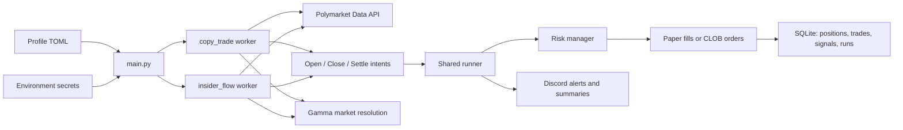
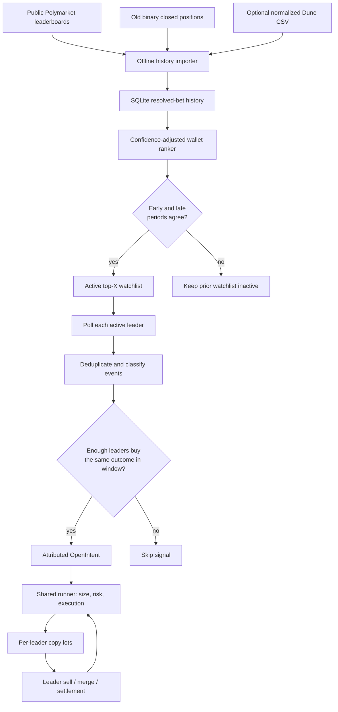

# Polymarket Copy-Trading Bot

Runs pluggable trading strategies against Polymarket: mirroring profitable
wallets (`copy_trade`) and copying suspicious fresh-wallet whale bets
(`insider_flow`). Per-algorithm paper/live modes, tiered bet sizing, risk
limits, Discord notifications, and signal logging for later modeling.

The thesis behind `copy_trade`: only copy *high-conviction* positions —
sizing keys off the target's **absolute holding** in a market (default floor
$80k), not their per-trade size.

## How it works

1. **Profile** — `PROFILE` selects `config/<profile>.toml`, which declares the algorithms to run; each runs in its own worker thread with its own risk pool and (paper) bankroll
2. **Detect** — each algorithm polls a Polymarket API (a target's activity, or the platform-wide trade firehose) and yields intents
3. **Size + risk check** — tier sizing off the target's *total holding*; per-position, total-exposure, and daily-loss caps enforced before every order
4. **Execute** — paper simulation, or market (FAK) / limit (GTC) orders via the CLOB API
5. **Track + notify** — positions, P&L, and signal features in SQLite; Discord alerts, daily summary, and a weekly signal digest

## Architecture



Each configured algorithm gets its own worker thread, risk limits, polling
cadence, and paper bankroll; a crash in one doesn't affect the others. The
shared runner is the only layer that turns an intent into a simulated or
live order. Adding a strategy means subclassing `Algorithm`, registering it
in `algorithms/__init__.py:REGISTRY`, and naming it in a profile TOML.

```
main.py        entry point — one worker thread per enabled algorithm
bot/           shared infra: config, DB, runner, risk, fetcher, notifier, Discord bot
algorithms/    strategies — copy_trade/, insider_flow/
config/        profile TOMLs (behavior) + webhooks.toml (Discord routing)
discovery/     price-history archiver
scripts/       deploy, wallet-history importers, DB reset, account summary
tests/         pytest suite
research/      strategy plans and paper-phase notes
data/          SQLite files — gitignored
```

## Ranked multi-leader copy

`copy_trade` can follow a scored cohort of wallets instead of one target.
`watchlist_size = 0` (the default) keeps legacy single-target mode.



Copied fills are tracked as per-leader *lots*, so one leader's exit only
unwinds that leader's share while the aggregate position stays intact for
accounting and execution.

The public importer (`scripts/import_polymarket_wallet_history.py`) is
deliberately a paper-testing seed: it only uses old, binary closed-position
prices and does not prove the original execution was copyable.
Dune-normalized fill history (`scripts/import_wallet_history.py`) remains
the stronger source for research and any future live review.

## Setup

```bash
python3 -m venv .venv
source .venv/bin/activate
pip install -r requirements.txt        # runtime deps + pytest
cp .env.example .env                   # secrets only — see below
```

## Configuration

Three files, split by kind:

| File | Holds | Committed |
|---|---|---|
| `config/<profile>.toml` | *Behavior* — which algorithms run, mode, targets, tiers, risk caps | yes |
| `config/webhooks.toml` | *Discord routing* — which channel each profile's summaries go to | yes (repo is private — rotate before it isn't) |
| `.env` / `.env.<profile>` | *Secrets only* — the five `POLY_*` creds, Discord bot token | no |

There is **no global paper/live switch.** Mode is declared per `[[algorithm]]`
block, so one process can run live and paper algorithms side by side. A
profile must set top-level `allow_live = true` before any `mode = "live"`
block is accepted, and only `prod.toml` sets it.

Each block sets `type` (registry key), `name` (**DB partition key — keep it
stable; renaming orphans that algorithm's bankroll and history**), `mode`,
and an optional `[algorithm.params]` table. Omitted knobs use schema
defaults from `algorithms/<type>/params.py`; discover them rather than
hunting through docs:

```bash
python -m bot.params                  # what algorithm types exist
python -m bot.params copy_trade       # every knob: default + description
python -m bot.params --effective      # exactly what $PROFILE resolves to (* = non-default)
python -m bot.report                  # performance per algorithm
```

Tuning and prod promotion are TOML edits, never code edits. The loader
validates at boot — unknown keys, duplicate names, bad modes, and
`validate()` violations all crash with a pointed error instead of silently
doing nothing.

## Running

```bash
PROFILE=experimental python main.py     # paper A/B variants
PROFILE=prod python main.py             # live — needs POLY_* creds
```

`PROFILE` is required; there is no default, by design. A bare
`python main.py` exits with an error naming the available profiles instead
of guessing which config (and which mode) to trade with.

The discovery price archiver should run alongside — the public API drops
price history once markets resolve, so it's the raw material for backtests:

```bash
python -m discovery.archive --once              # one pass (cron-friendly)
python -m discovery.archive --loop --every 3600
```

## Testing

```bash
pytest
pytest tests/test_copy_trade.py
```

## Deployment

Runs on a VPS as plain Python processes under tmux.

```bash
bash scripts/ssh_vm.sh                       # opc@148.116.94.154, ~/Polymarket
cd ~/Polymarket && bash scripts/setup_vm.sh  # full redeploy
```

`setup_vm.sh` is the entire deploy: git pull, venv + deps, `data/` layout,
env hygiene (verifies the five `POLY_*` creds, strips stale non-secret
keys), profile validation, then a clean restart of the tmux sessions with
crash-visible panes — `remain-on-exit` is set, so attaching after a death
shows the traceback instead of an empty screen. Idempotent. It exits
non-zero if a session dies at boot and prints that session's last output.

Pushes to `main` run it automatically (`.github/workflows/ci.yml`, gated on
the test job). Running it by hand is for redeploying without a push; an
admin can also trigger it from Discord with `/restart`.

| Session | Command |
|---|---|
| `paper` | `PROFILE=experimental python main.py` |
| `prod` | `PROFILE=prod python main.py` — started only if `config/prod.toml` declares `[[algorithm]]` blocks |
| `archive` | `python -m discovery.archive --loop --every 3600` |
| `discord` | `python scripts/run_discord_bot.py` — one bot, all profiles |

`tmux attach -t <name>` to view, `Ctrl-b d` to detach without killing.

`data/positions.db` and `.env` live only on the host — both are gitignored
and must survive redeploys.

Two things that bite:

- **`setup_vm.sh` pulls partway through running itself**, so a version
  already executing is not the version that just landed. After changing the
  script, run it twice — once to pull, once to execute the new logic.
- **prod is currently paused.** `config/prod.toml` sets `allow_live = true`
  but declares no algorithms, so the `prod` session isn't started — that's
  intentional, not a failure; the script reports it and continues. To
  resume, copy a proven block from `experimental.toml`, flip
  `mode = "live"`, and keep `name` stable.

After a deploy, check: one startup line per algorithm in
`tmux attach -t paper` and in Discord, a first-pass summary in `archive`
(`tracked_added` / `points_added`), and no `Using legacy ./positions.db`
warning.

## Monitoring

Discord carries trade alerts, a daily summary, a liveness heartbeat, and a
weekly signal digest. `/status`, `/positions`, `/pnl`, `/summary`, and
`/restart` are available as slash commands.

```bash
python -m bot.report    # per-algo P&L, signal counts, skip reasons, win rate vs entry odds
```

That covers most questions; drop to SQL (`sqlite3 data/positions.db`) for
anything deeper:

```sql
-- Signal rate per day. A handful is healthy; dozens = filters too loose,
-- zero for a week = too tight.
SELECT date(ts,'unixepoch') d, COUNT(*) FROM signals
WHERE algo='insider_flow_paper' GROUP BY d ORDER BY d;

-- Skip reasons: many 'slippage' → signals move fast; many 'risk:' → caps
-- binding before the strategy can express itself.
SELECT skip_reason, COUNT(*) FROM signals WHERE executed=0 GROUP BY skip_reason;

-- The number the whole thesis rides on: do ~0.20-odds bets win
-- materially more than 20% of the time?
SELECT signal_price, outcome, pnl_usdc FROM signals
WHERE outcome IS NOT NULL ORDER BY outcome_ts;
```

Archive health (`sqlite3 data/discovery_archive.db`) — the last snapshot
should be under 2h old:

```sql
SELECT COUNT(*) FROM tracked_markets;
SELECT COUNT(*) FROM price_history;
SELECT datetime(MAX(last_snapshot),'unixepoch') FROM tracked_markets;
```

**Never `scp` one `discovery_archive.db` over another** — both machines
accumulate history the other lacks, and an overwrite destroys it. Upload
under a temp name and merge; both tables have natural PKs, so
`INSERT OR IGNORE` dedupes exactly:

```bash
scp -i ~/.ssh/ssh-key-2026-05-31.key data/discovery_archive.db \
    opc@148.116.94.154:~/Polymarket/data/laptop_archive.db
# then on the VPS:
cd ~/Polymarket/data && cp discovery_archive.db discovery_archive.db.bak && \
../.venv/bin/python - <<'EOF'
import sqlite3
db = sqlite3.connect("discovery_archive.db")
db.execute("ATTACH 'laptop_archive.db' AS laptop")
db.execute("INSERT OR IGNORE INTO price_history SELECT * FROM laptop.price_history")
db.execute("INSERT OR IGNORE INTO tracked_markets SELECT * FROM laptop.tracked_markets")
db.commit()
EOF
rm laptop_archive.db
```

Checkpoint: review paper results ~60–90 days after deploy before promoting
anything to live. What to watch and why is in
`research/branch_new_feature_uwu.md`.

## More

- `CLAUDE.md` — internals for AI agents: module map, DB schema, invariants
- `algorithms/copy_trade/design.md` — tier model, signal semantics, edge cases
- `research/` — strategy plans and paper-phase observations
