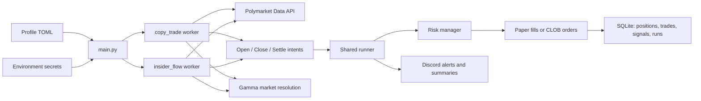
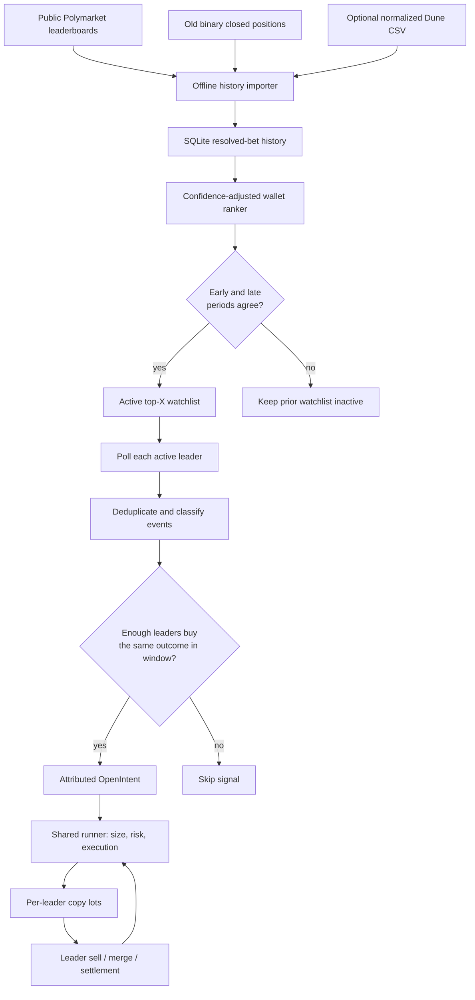

# Polymarket Copy-Trading Bot

Runs pluggable trading strategies against Polymarket: mirroring a known
profitable wallet (`copy_trade`) and copying suspicious fresh-wallet whale
bets (`insider_flow`). Per-algorithm paper/live modes, tiered bet sizing,
risk limits, Discord notifications, and signal logging for later modeling.

## How it works

1. **Profile** — `PROFILE` selects `config/<profile>.toml`, which declares the algorithms to run; each runs in its own worker thread with its own risk pool and (paper) bankroll
2. **Detect** — each algorithm polls a Polymarket API (a target's activity, or the platform-wide trade firehose) and yields intents
3. **Size + risk check** — tier sizing off the target's *total holding*; per-position, total-exposure, and daily-loss caps enforced before every order
4. **Execute** — paper simulation, or market (FAK) / limit (GTC) orders via the CLOB API
5. **Track + notify** — positions, P&L, and signal features in SQLite; Discord alerts and a daily summary

## Architecture



Each configured algorithm has its own worker, risk limits, polling cadence,
and paper bankroll. The shared runner is the only layer that turns an intent
into a simulated or live order.

## Ranked multi-leader copy algorithm



The public importer is deliberately a paper-testing seed: it only uses old,
binary closed-position prices and does not prove the original execution was
copyable. Dune-normalized fill history remains the stronger source for
research and any future live review.

## Setup

```bash
python3 -m venv .venv
source .venv/bin/activate
pip install -r requirements.txt        # runtime deps + pytest
cp .env.example .env                   # secrets + webhook only — see below
```

## Configuration — one place

**Behavior** lives in `config/<profile>.toml` (committed): which algorithms
run, paper/live mode, targets, tiers, risk caps. **Secrets** live in
`.env` / `.env.<profile>` (gitignored): `POLY_*` credentials, Discord
webhook, timezone.

```bash
python -m bot.params                  # what algorithm types exist
python -m bot.params copy_trade       # every knob: default + description
python -m bot.params --effective      # exactly what $PROFILE will run
python -m bot.report                  # performance per algorithm
```

To tune or promote to prod: edit the TOML, commit, pull on the server,
restart. The loader validates at boot — typos crash with a pointed error
instead of silently doing nothing.

## Running

```bash
PROFILE=experimental python main.py     # paper A/B variants
PROFILE=prod python main.py             # live — needs POLY_* creds in .env.prod
```

`PROFILE` is required — there is no default profile, by design. A bare
`python main.py` exits with an error instead of guessing which config
(and which mode) to trade with.

The discovery price archiver should run alongside (the public API drops
price history at resolution):

```bash
python -m discovery.archive --loop --every 3600
```

## Testing

```bash
pytest
```

## More

- `CLAUDE.md` — architecture, schema, API reference
- `manual.md` — VPS deploy runbook + paper-phase monitoring
- `research/` — strategy plans
