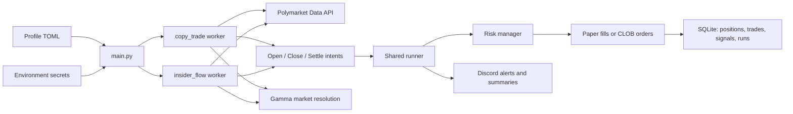
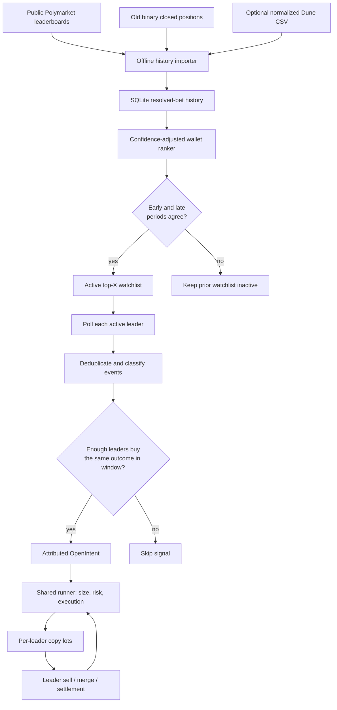

# Polymarket Copy-Trading Bot

Runs pluggable trading strategies against Polymarket: mirroring a known
profitable wallet (`copy_trade`) and copying suspicious fresh-wallet whale
bets (`insider_flow`). Per-algorithm paper/live modes, tiered bet sizing,
risk limits, Discord notifications, and signal logging for later modeling.

## How it works

1. **Profile** — `PROFILE` selects `config/<profile>.toml`, which declares the algorithms to run; each runs in its own worker thread with its own risk pool and (paper) bankroll
2. **Detect** — each algorithm polls a Polymarket API (a target's activity, or the platform-wide trade firehose) and yields intents
3. **Size + risk check** — tier sizing off the target's *total holding*; per-position, total-exposure, and daily-loss caps enforced before every order
4. **Execute** — paper simulation, or market (FAK) / limit (GTC) orders via the CLOB API
5. **Track + notify** — positions, P&L, and signal features in SQLite; Discord alerts and a daily summary

## Architecture



Each configured algorithm has its own worker, risk limits, polling cadence,
and paper bankroll. The shared runner is the only layer that turns an intent
into a simulated or live order.

## Ranked multi-leader copy algorithm



The public importer is deliberately a paper-testing seed: it only uses old,
binary closed-position prices and does not prove the original execution was
copyable. Dune-normalized fill history remains the stronger source for
research and any future live review.

## Setup

```bash
python3 -m venv .venv
source .venv/bin/activate
pip install -r requirements.txt        # runtime deps + pytest
cp .env.example .env                   # secrets + webhook only — see below
```

## Configuration — one place

**Behavior** lives in `config/<profile>.toml` (committed): which algorithms
run, paper/live mode, targets, tiers, risk caps. **Secrets** live in
`.env` / `.env.<profile>` (gitignored): `POLY_*` credentials, Discord
webhook, timezone.

```bash
python -m bot.params                  # what algorithm types exist
python -m bot.params copy_trade       # every knob: default + description
python -m bot.params --effective      # exactly what $PROFILE will run
python -m bot.report                  # performance per algorithm
```

To tune or promote to prod: edit the TOML, commit, pull on the server,
restart. The loader validates at boot — typos crash with a pointed error
instead of silently doing nothing.

## Running

```bash
PROFILE=experimental python main.py     # paper A/B variants
PROFILE=prod python main.py             # live — needs POLY_* creds in .env.prod
```

`PROFILE` is required — there is no default profile, by design. A bare
`python main.py` exits with an error instead of guessing which config
(and which mode) to trade with.

The discovery price archiver should run alongside (the public API drops
price history at resolution):

```bash
python -m discovery.archive --loop --every 3600
```

## Testing

```bash
pytest
```

## Deployment

Runs on a VPS as plain Python processes under tmux.

```bash
bash scripts/ssh_vm.sh                       # opc@148.116.94.154
cd ~/Polymarket && bash scripts/setup_vm.sh  # full redeploy
```

`setup_vm.sh` is the entire deploy: git pull, venv + deps, `data/` layout,
env hygiene (verifies the five `POLY_*` creds, strips stale non-secret
keys), profile validation, then a clean restart of the tmux sessions with
crash-visible panes — `remain-on-exit` is set, so attaching after a death
shows the traceback instead of an empty screen. Idempotent. It exits
non-zero if a session dies at boot and prints that session's last output.

Pushes to `main` run it automatically (`.github/workflows/ci.yml`, gated on
the test job passing). Running it by hand is for redeploying without a push.

| Session | Command |
|---|---|
| `paper` | `PROFILE=experimental python main.py` |
| `prod` | `PROFILE=prod python main.py` — started only if `config/prod.toml` declares `[[algorithm]]` blocks |
| `archive` | `python -m discovery.archive --loop --every 3600` |
| `discord` | `python scripts/run_discord_bot.py` |

`tmux attach -t <name>` to view, `Ctrl-b d` to detach without killing.

Two things that bite:

- **`setup_vm.sh` pulls partway through running itself**, so a version
  already executing is not the version that just landed. After changing the
  script, run it twice — once to pull, once to execute the new logic.
- **prod is currently paused.** `config/prod.toml` sets `allow_live = true`
  but declares no algorithms, so the `prod` session isn't started — that's
  intentional, not a failure; the script reports it and continues. To
  resume, copy a proven block from `experimental.toml`, flip
  `mode = "live"`, and keep `name` stable (it's the DB partition key —
  renaming orphans that algorithm's bankroll and history).

After a deploy, check: one startup line per algorithm in
`tmux attach -t paper` and in Discord, a first-pass summary in `archive`
(`tracked_added` / `points_added`), and no `Using legacy ./positions.db`
warning.

## Monitoring

```bash
python -m bot.report    # per-algo P&L, signal counts, skip reasons, win rate vs entry odds
```

That covers most questions; drop to SQL (`sqlite3 data/positions.db`) for
anything deeper:

```sql
-- Signal rate per day. A handful is healthy; dozens = filters too loose,
-- zero for a week = too tight.
SELECT date(ts,'unixepoch') d, COUNT(*) FROM signals
WHERE algo='insider_flow_paper' GROUP BY d ORDER BY d;

-- Skip reasons: many 'slippage' → signals move fast; many 'risk:' → caps
-- binding before the strategy can express itself.
SELECT skip_reason, COUNT(*) FROM signals WHERE executed=0 GROUP BY skip_reason;

-- The number the whole thesis rides on: do ~0.20-odds bets win
-- materially more than 20% of the time?
SELECT signal_price, outcome, pnl_usdc FROM signals
WHERE outcome IS NOT NULL ORDER BY outcome_ts;

-- Feature health: /value reliability, wallet ages we're actually catching
SELECT json_extract(features,'$.portfolio_value_usdc') AS pv,
       json_extract(features,'$.wallet_age_seconds')/86400.0 AS age_days,
       json_extract(features,'$.detect_latency_seconds') AS latency_s
FROM signals WHERE algo='insider_flow_paper';
```

Archive health (`sqlite3 data/discovery_archive.db`) — the last snapshot
should be under 2h old:

```sql
SELECT COUNT(*) FROM tracked_markets;
SELECT COUNT(*) FROM price_history;
SELECT datetime(MAX(last_snapshot),'unixepoch') FROM tracked_markets;
```

**Never `scp` one `discovery_archive.db` over another** — both machines
accumulate history the other lacks, and an overwrite destroys it. Upload
under a temp name and merge; both tables have natural PKs, so
`INSERT OR IGNORE` dedupes exactly:

```bash
scp -i ~/.ssh/ssh-key-2026-05-31.key data/discovery_archive.db \
    opc@148.116.94.154:~/Polymarket/data/laptop_archive.db
# then on the VPS:
cd ~/Polymarket/data && cp discovery_archive.db discovery_archive.db.bak && \
../.venv/bin/python - <<'EOF'
import sqlite3
db = sqlite3.connect("discovery_archive.db")
db.execute("ATTACH 'laptop_archive.db' AS laptop")
db.execute("INSERT OR IGNORE INTO price_history SELECT * FROM laptop.price_history")
db.execute("INSERT OR IGNORE INTO tracked_markets SELECT * FROM laptop.tracked_markets")
db.commit()
EOF
rm laptop_archive.db
```

Checkpoint: review paper results ~60–90 days after deploy before promoting
anything to live. What to watch and why is in
`research/branch_new_feature_uwu.md`.

## More

- `CLAUDE.md` — architecture, schema, API reference
- `research/` — strategy plans and paper-phase observations
